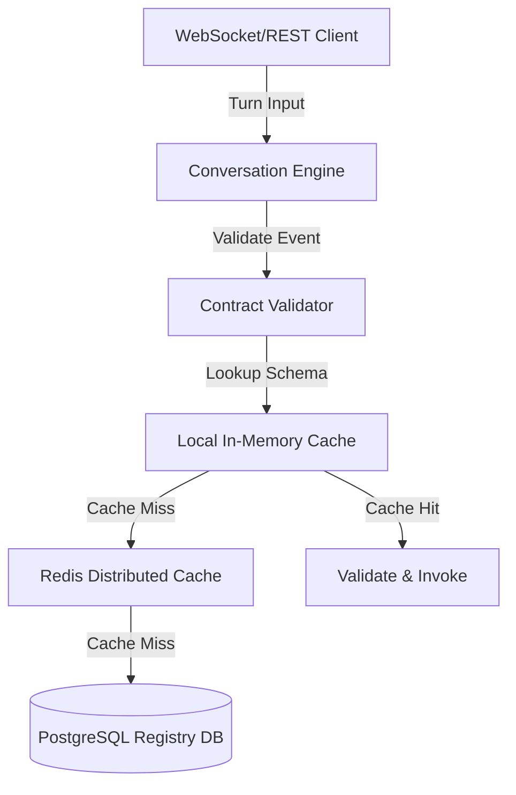

# Caching Architecture

## Maturity Metadata

**Status:** Approved.

**Intended Use:** Authoritative architectural design and specifications for Lyra caching layers.

## Purpose

Define the caching layers, policies, and invalidation strategies required to meet Lyra's low-latency performance targets (sub-100ms turn overhead at the protocol edge) and protect downstream consumer APIs from validation storms.

## Caching Strategy

Lyra implements a multi-tier caching architecture to avoid expensive schema compilation and database queries on every conversational turn.

### 1. Local In-Memory Schema Cache
* **Scope:** Instantiated inside each Capability Registry runtime container.
* **Content:** Compiled JSON Schema objects and validated tenant capability contracts.
* **Size Constraint:** Configured with a Least Recently Used (LRU) eviction policy capped at 2,000 compiled schemas.
* **Duration (TTL):** Hard TTL of 60 minutes.
* **Rationale:** Compiling complex JSON Schema Draft 2020-12 rules on every turn is CPU-intensive. Local memory lookup reduces schema validation overhead to <1ms.

### 2. Distributed Cache Layer (Redis)
* **Scope:** Multi-node Redis cluster shared across all horizontal engine pods.
* **Content:** Active conversation turn logs, session metadata, and tenant configuration blocks.
* **Duration (TTL):** Capped at 24 hours of session inactivity.
* **Access Mode:** Read-through/Write-through.

### 3. Cache Invalidation Workflows
When a tenant updates or registers a new contract:
1. The administrative registry service emits a `CONTRACT_UPDATED` event to the Event Broker.
2. A subscription listener in the Capability Registry triggers cache eviction matching the `tenant_id` and `contract_id`.
3. The next execution turn forces a reload from the PostgreSQL metadata tables.

### 4. Cache Warmup Strategy
On container startup or deployment rollout, the Capability Registry performs a warmup query loading the top 20% most active capability contracts (based on turn log history) into local memory. This prevents cold starts from degrading latency budgets during system scale-ups.
