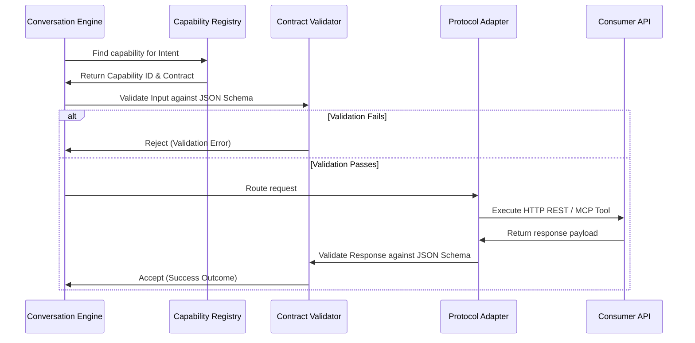

# Capability Invocation

## Maturity Metadata

**Status:** Approved.

**Intended Use:** Authoritative capability invocation model, payload validation guidelines, and protocol integration details.

## Purpose

Define how Lyra discovers, validates, and executes external consumer capabilities across different integration protocols.

## Invocation Sequence Diagram

## Integration Protocols

1. **REST / HTTP (JSON):**
   - Direct HTTP POST calls to consumer endpoints.
   - Credentials (API Keys, Bearer Tokens) injected at adapter layer.
2. **OpenAPI Imports:**
   - Registry dynamically generates client adapters by importing OpenAPI v3 specifications.
3. **Model Context Protocol (MCP):**
   - Leverages standard MCP tool declarations. Lyra acts as an MCP Client invoking tools exposed by consumer MCP Servers.

## Caching Strategy

Registered contracts and JSON Schemas are cached locally inside the Capability Registry. Changes to registered contracts trigger cache invalidation via Webhook registries or administrative CLI commands.

## Voice Pipeline Integration

When a customer speaks:
- Audio is streamed to the **Voice Pipeline Adapter**.
- **Speech-to-Text (STT)** produces transcript text.
- **NLU Engine** classifies intent and extracts entities.
- If the playbook workflow maps the intent to a capability, **Capability Invocation** is triggered with extracted entities as parameters.
- Response payload is mapped to a TTS template to stream synthesized speech (**Text-to-Speech**) back to the client.

## Related Documents

- Context: [System Overview](./system-overview.md)
- Component Map: [Component Architecture](./component-architecture.md)
