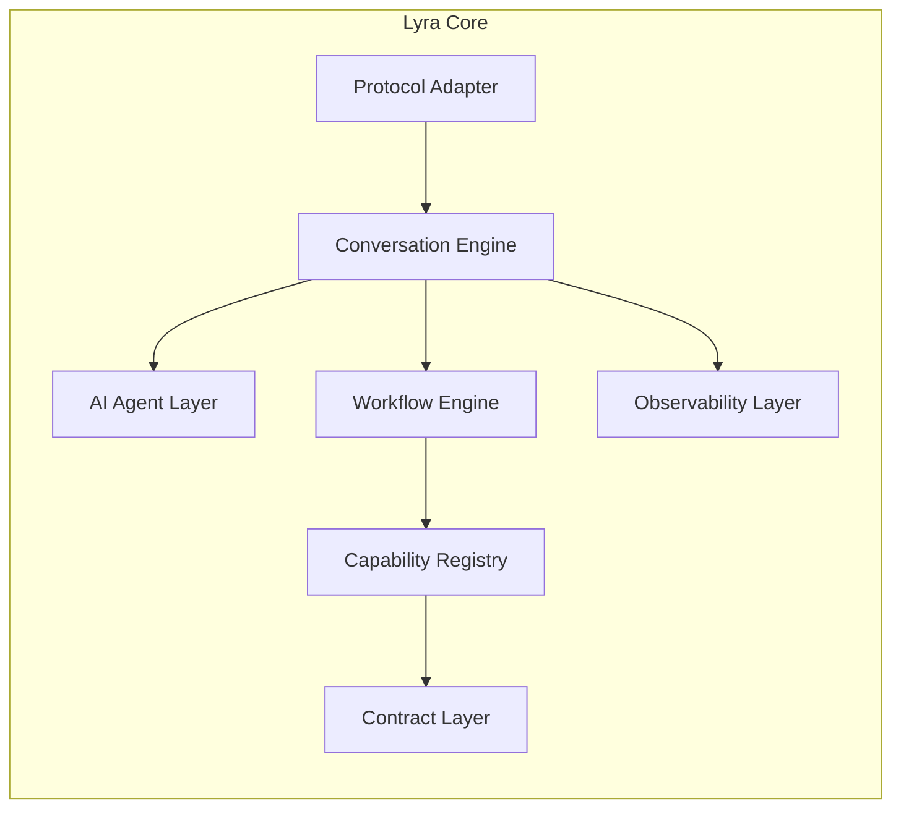

# Component Architecture

## Maturity Metadata

**Status:** Approved.

**Intended Use:** Authoritative component breakdown, responsibilities, and interface specifications for Lyra developers.

## Purpose

Define the major architectural components of Lyra, mapping their responsibilities, boundaries, and communication paths.

## Component Breakdown

### 1. Protocol Adapter
- **Responsibility:** Adapts edge transport protocols (WebSockets for streaming audio, REST for HTTP clients, MCP for agentic clients) to Lyra's internal event structure.
- **Interfaces:** Exposed endpoints `/v1/conversation/stream` (WebSockets) and `/v1/conversation/message` (REST).

### 2. Conversation Engine
- **Responsibility:** Manages the conversational session state machine, coordinates dialog turns, triggers audio recording pipelines, and logs transcripts.
- **Data Boundaries:** Owns database session tables and S3-compatible audio logs.

### 3. AI Agent Layer
- **Responsibility:** Interfaces with LLMs and NLU models to parse customer input, resolve intents, extract entities, and generate dialogue outputs.

### 4. Workflow Engine
- **Responsibility:** Coordinates playbook execution, processes transition steps, manages entity slot filling, and triggers escalations to human agents.

### 5. Capability Registry
- **Responsibility:** Caches registered consumer contracts and exposes a lookup API for matching capabilities to active customer intents.

### 6. Contract Layer
- **Responsibility:** Validates capability request and response payloads against registered schemas.

### 7. Observability Layer
- **Responsibility:** Streams structured decision events, latency metrics, and invocation results to audit targets and webhooks.

## Related Documents

- Context and Deployment: [System Overview](./system-overview.md)
- Turn State Machine: [Conversation Lifecycle](./conversation-lifecycle.md)
