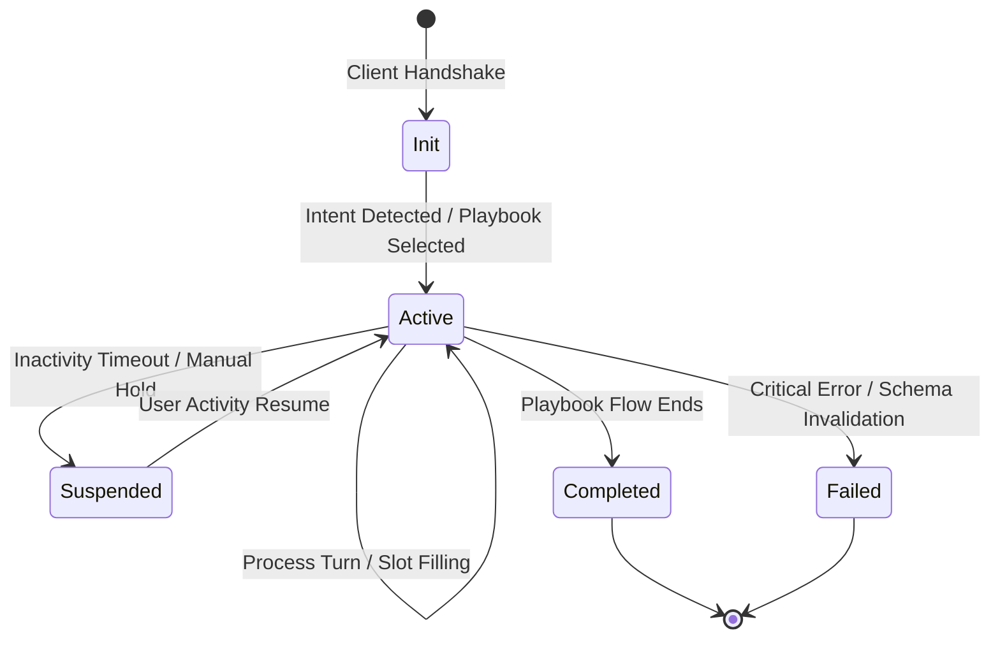

# Conversation Lifecycle

## Maturity Metadata

**Status:** Approved.

**Intended Use:** Authoritative conversation lifecycle states and session transition rules for implementation.

## Purpose

Define the state machine governing conversation sessions in Lyra, illustrating how sessions are initiated, coordinated, suspended, and terminated.

## Conversation State Machine

## Lifecycle States and Transitions

1. **Init (Initiated):**
   - *Trigger:* Client connects via REST or WebSockets.
   - *Action:* Lyra establishes a session UUID, loads tenant policies, and initializes empty slots.

2. **Active (Orchestrating):**
   - *Trigger:* First intent classified. Playbook is selected.
   - *Action:* Dialogue turns are processed sequentially. User input is transcribed, intent resolved, and capabilities are invoked as needed.

3. **Suspended (Inactive):**
   - *Trigger:* Session inactivity exceeds standard thresholds (e.g., 60 seconds of silence) or manual hold signal.
   - *Action:* State is serialized to the session log. Prompt resources are released.

4. **Completed (Terminated):**
   - *Trigger:* Playbook flow finishes all required steps.
   - *Action:* Transcripts are redacted and finalized. S3 audio records are closed.

5. **Failed (Aborted):**
   - *Trigger:* Critical validation failure (e.g., consumer capability returns schema-invalid response) or repeated timeout.
   - *Action:* System records failure event, emits notification to Observability, and closes connection.

## Related Documents

- Platform Layout: [System Overview](./system-overview.md)
- Integration Details: [Capability Invocation](./capability-invocation.md)
