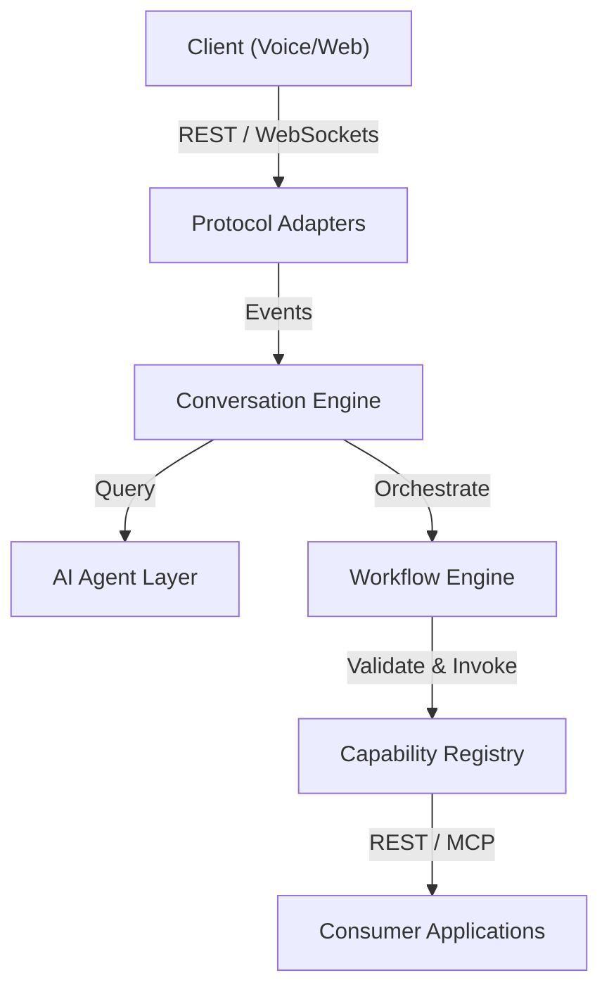

# System Overview

## Maturity Metadata

**Status:** Approved.

**Intended Use:** Authoritative system overview, multi-tenancy rules, and deployment scalability model for Lyra architecture.

## Purpose

Provide a comprehensive system-level description of Lyra, explaining the logical layout, deployment topology, scalability design, and tenant isolation policies.

## System Context Diagram

## Architectural Design

Lyra is structured as a stateless, event-driven orchestration system:

1. **Pluggable Protocol Adapters:** Positioned at the edge to convert incoming audio, text, or metadata into standardized conversation event streams.
2. **Asynchronous Conversation Engine:** Coordinates dialogue turns, captures audio telemetry, and persists session logs (transcripts/recordings).
3. **Model-Agnostic NLU / AI Layer:** Leverages Large Language Models to perform intent detection and entity slot filling without hardcoded prompt paths.
4. **Stateless Workflow Coordinator:** Executes playbooks and processes webhook events according to configured state rules.

## Multi-Tenancy and Security Isolation

* **Logical Isolation:** All database tables and object storage partitions must include a mandatory `tenant_id` field.
* **Access Control:** Every session event and capability invocation is checked against the organization's security policy.
* **Separation of Keys:** API keys and credentials for consumer systems must be retrieved from secure vaults (e.g. HashiCorp Vault) using the `tenant_id` as the namespace.

## Deployment and Scalability

* **Stateless Runtime:** All core components run as containerized microservices (e.g., on Kubernetes). They do not share memory and scale horizontally based on CPU/Memory usage.
* **Caching Strategy:** Capability registry contracts and schemas are cached locally to minimize latency during validations.
* **Asynchronous Offloading:** Transcripts processing and audio compression are offloaded to background queues (e.g., Celery or RabbitMQ) to guarantee sub-100ms response times at the protocol edge.

## Related Documents

- Detailed component layout: [Component Architecture](./component-architecture.md)
- Session state machine: [Conversation Lifecycle](./conversation-lifecycle.md)
- Capability call details: [Capability Invocation](./capability-invocation.md)
